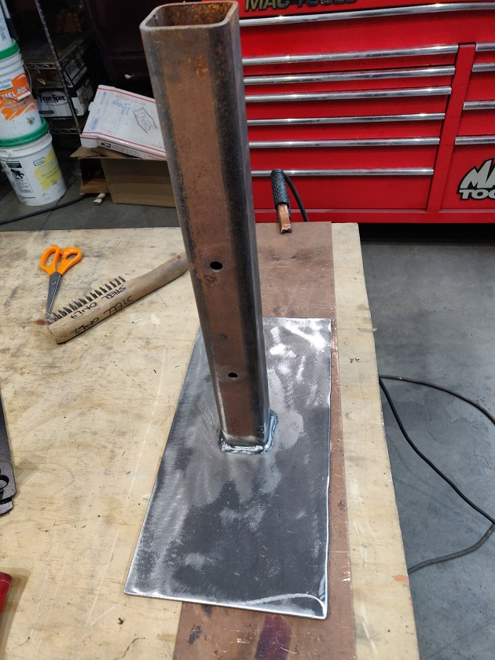
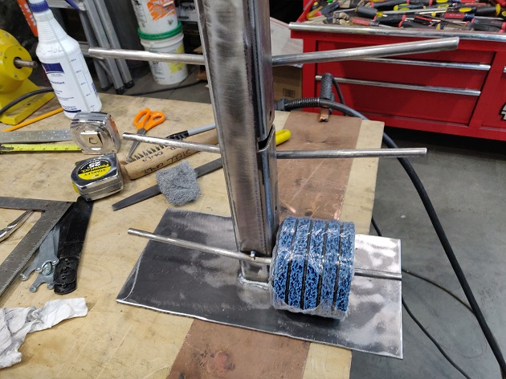
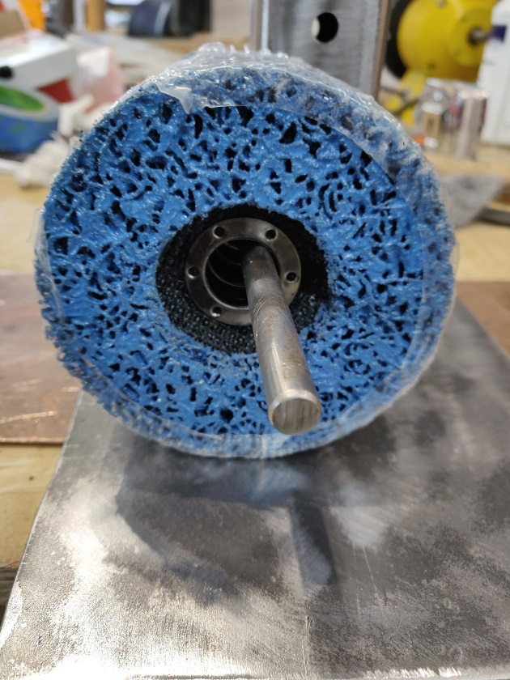
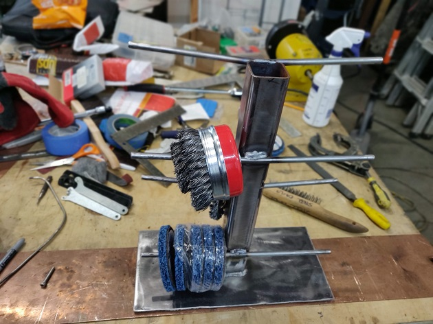
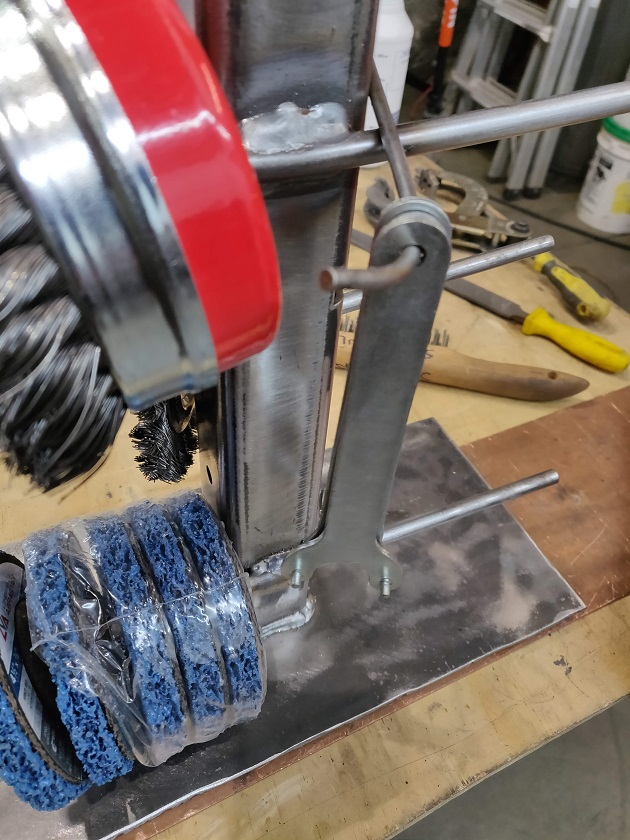
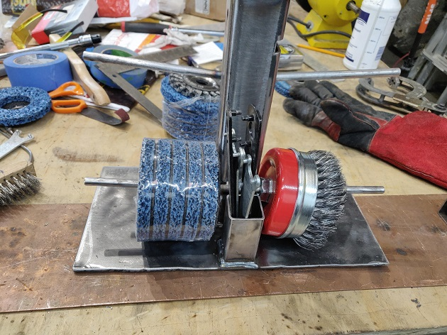
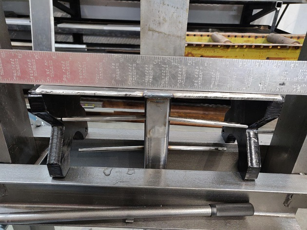
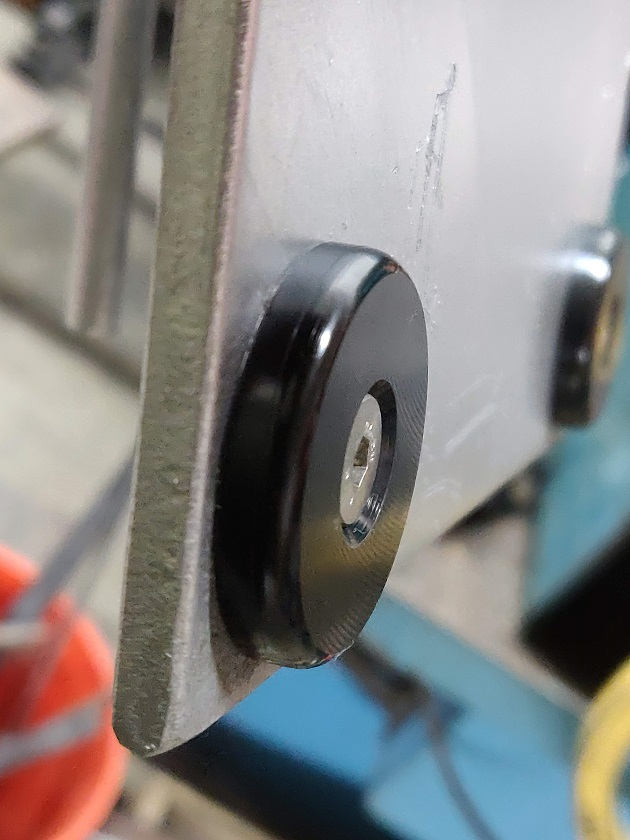
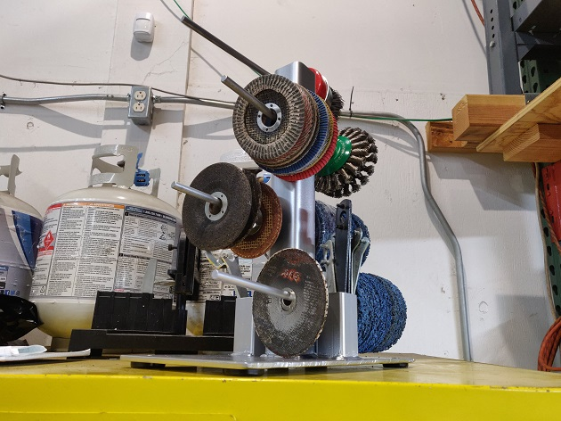

I went to Home Depot the other morning to get a grinding disc in anticipation of a project. Well I bought a grinding disc I already had, but I did not buy the one I needed!

Since my last move, my grinding discs have been tucked away in several boxes in a cabinet. This made it really hard to do a general assessment or find a disc. That needed to change.

As it turned out, I had the perfect pieces cut to size in the scrap bin. I did do a quick <a href="https://cad.onshape.com/documents/051d3a49fa876088d094ccb1/w/1890f058e50a78405dbb7900/e/8f715ca3e3cd102d16f5364b" target="_blank">cad layout in Onshape</a>.

I put a slight angle on the rods using my home made bender. I just made the first one and used it as a gauge for the next ones.

I tacked it all up, but it did not work.

Forgot to account for the slop in the hole.

So I cut them off, moved them up a bit and rewelded.

Then I realized I needed something to hold the wrenches. First thought of welding on a small rod, but you would have to take all the wrenches off to get to the inner wrench. No bueno.

So more scrap tubing to the rescue!

It warped due to all the welds in the center so I put it in the press to straighten it out.

I sprayed some old rattle can paint on it. I believe the paint was left over from making Festivus Poles for Santacon. We made them out of cardboard McmasterCarr tubes so they would be disposable.

I milled up some slider feet so as not to scratch the paint job when I spin it. It probably would have helped if I let the paint dry, but that never happens. Once setup on milling using a cutoff saw.

And it is done! And I know exactly what grinding discs I have!

Thanks for looking! <a href="https://cad.onshape.com/documents/051d3a49fa876088d094ccb1/w/1890f058e50a78405dbb7900/e/8f715ca3e3cd102d16f5364b" target="_blank">There are more pics, CAD, and CAM here...</a>
